<h1 align="center">KeyKorea</h1>

<h3 align="center">
  <a href="https://keykorea.vercel.app/">Visit the live app</a> |
  <a href="https://github.com/JarrodMalkovic/typing-website/issues">Report Bug</a> |
  <a href="https://github.com/JarrodMalkovic/typing-website/issues">Request Feature</a>
</h3>


## 📝 Table of contents

- [Run Locally](#-run-locally)
- [Screenshots](#-screenshots)
- [Technologies](#-technologies)
- [License](#-license)

## 🚀 Run Locally

### Clone repo to your local machine

```bash
git clone git@github.com:JarrodMalkovic/typing-website.git
```

### Run the frontend

#### Install client dependencies

```bash
cd client
npm install
```

#### Run the development server

```bash
yarn dev
```

from the ./client directory

Open <http://localhost:3000> with your browser to see the result.

### Run the backend

#### Setting environment variables

- Create an account on cloudinary.com
- Create a copy of the file .env.example within the /api directory and rename the copy to .env
- Fill out the .env file using your cloudinary credentials

#### Start the Django App and the Postgres Database

```bash
docker-compose up
```

## 📸 Screenshots

| Dark Mode | Light Mode |
|-----------|------------|
| 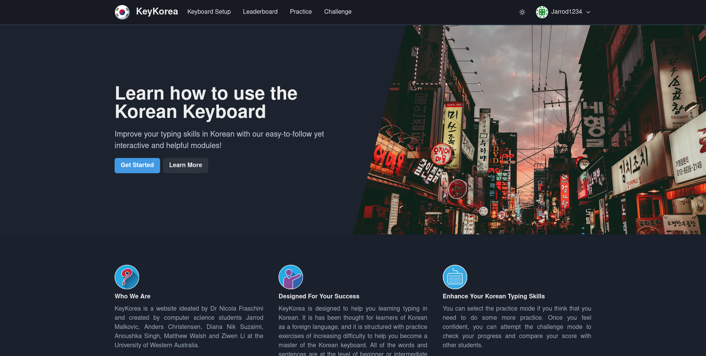 | 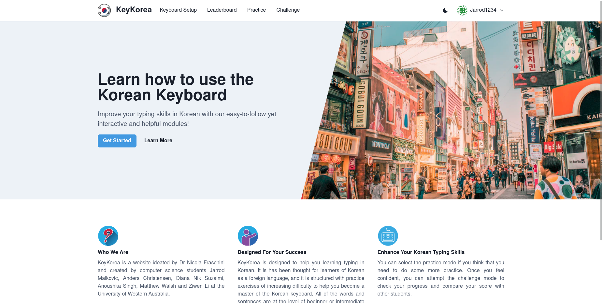 |
| 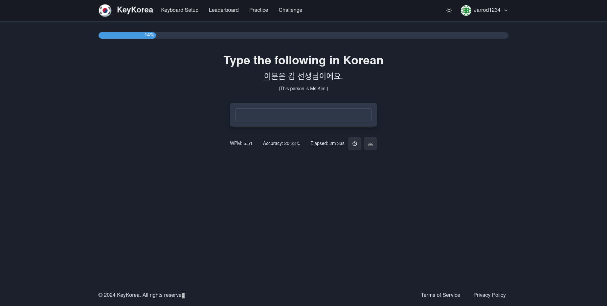 |  |
| 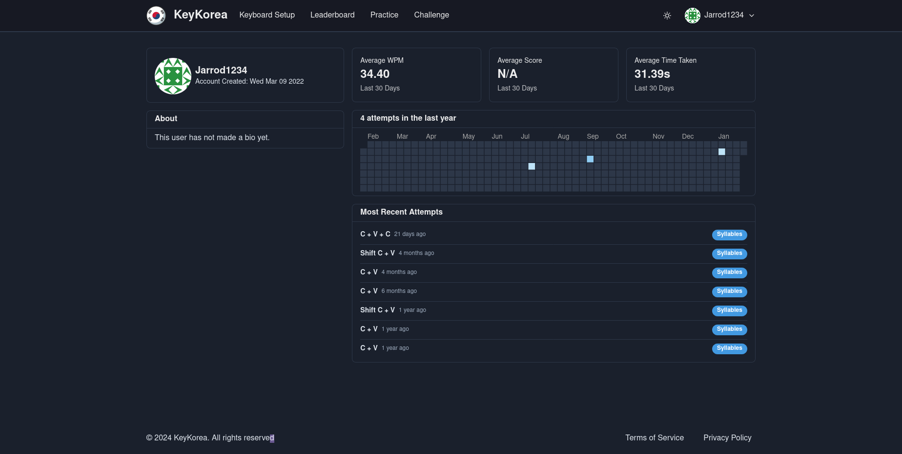 | 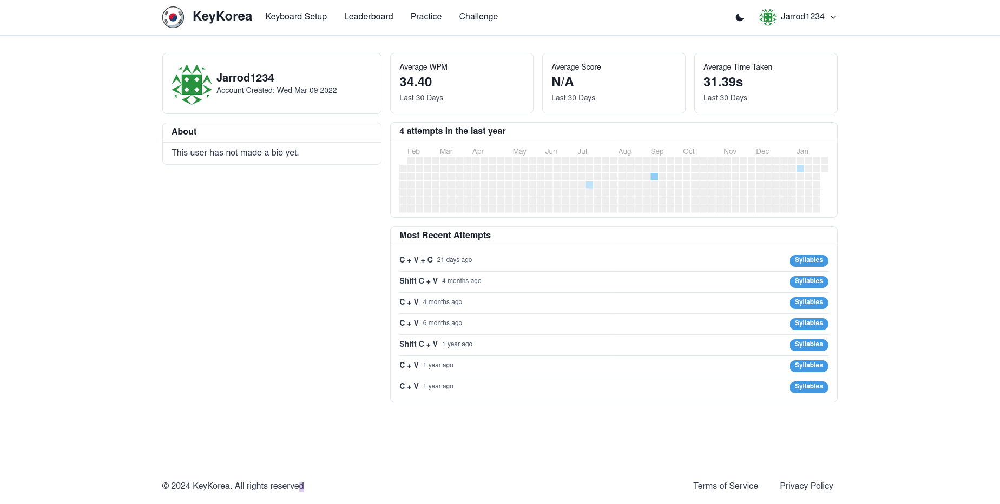 |
| 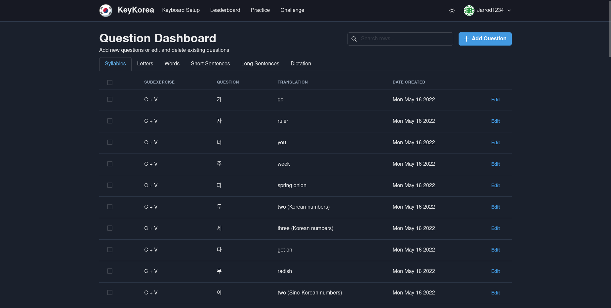 | 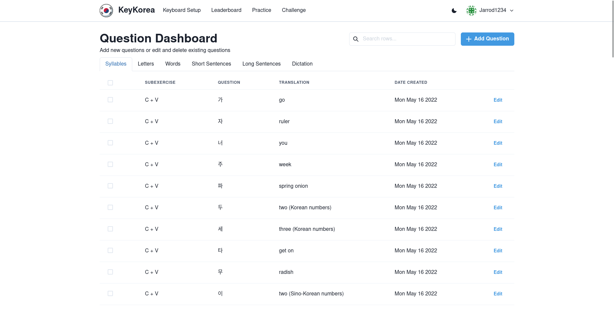 |
| 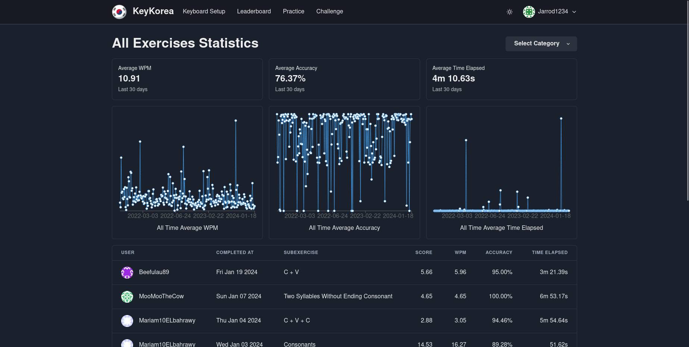 | 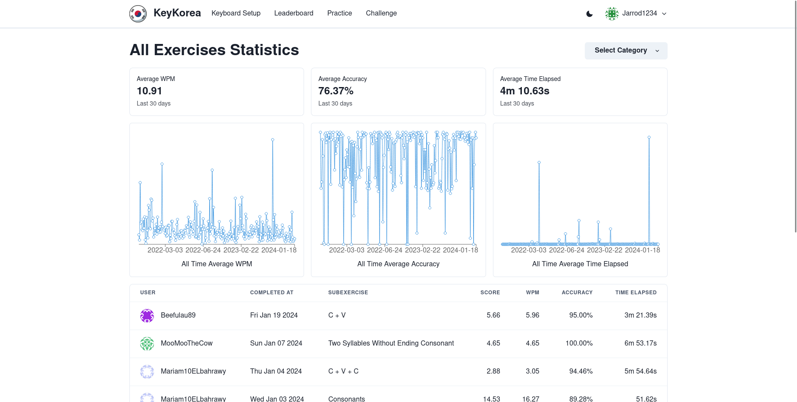 |
| 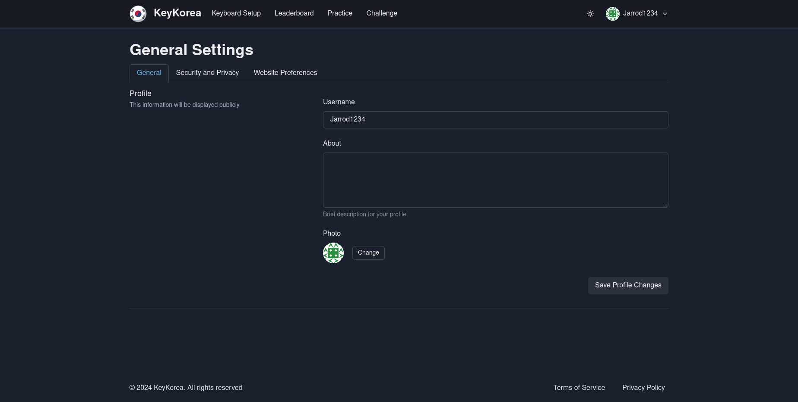 | 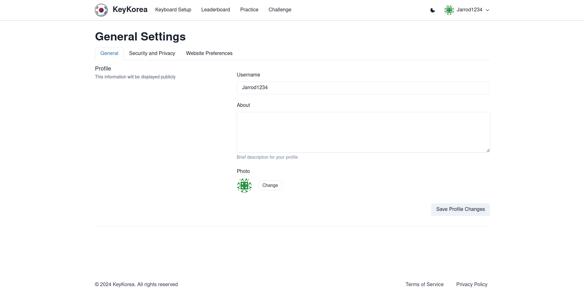 |
| 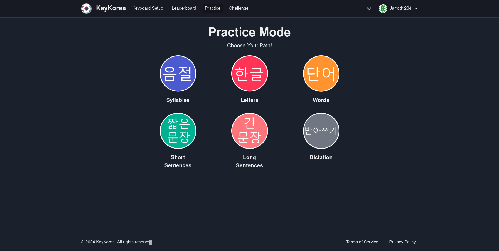 |  |
## 💻 Technologies

This project is is created with:

- React, Next.js, Python, Django Rest Framework and PostgreSQL

## ⚖️ License

This project is licensed under the MIT License

<hr>

<h3>
  <a href="https://keykorea.vercel.app/">Visit the live app</a> |
  <a href="https://github.com/JarrodMalkovic/typing-website/issues">Report Bug</a> |
  <a href="https://github.com/JarrodMalkovic/typing-website/issues">Request Feature</a>
</h3>
